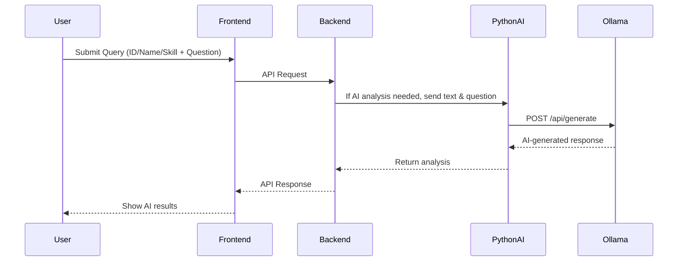

### 1. User Flow Diagram

```mermaid
graph TD
  A[User (UI)] -->|Enter Employee ID/Name or Skill| B[Frontend (HTML+JS)]
  B -->|REST API| C[Spring Boot Backend]
  C -->|Fetch Employee Data| D[Database]
  C -->|Fetch/Extract Resume| E[File System]
  C -->|Analyze with AI| F[AI_Model.py (Python)]
  F -->|Call Ollama LLM| G[Ollama API]
  C -->|Return Results| B
  B -->|Display| A
```

---

### 2. AI Analysis Flow



---

## 🛠️ Main Functionalities

### 1. **Employee CRUD APIs**
- Create, read, update, delete employees.
- Fetch employee by ID or name.
- API: `/api/employees`, `/api/employees/{id}`, `/api/employees/search-by-skill?skill=...`

### 2. **File/Resume Upload & Extraction**
- Upload employee files (resume, docs) to server.
- Extract text from files using Apache Tika.
- API: `/api/files/upload`, `/api/files/analyze/employee/{id}`

### 3. **AI-Powered Resume/Document Analysis**
- Analyze resume text with Ollama LLM (models: phi3, llama3).
- Custom user queries (skills, experience, qualification extraction, etc).
- AI integration via `/api/generate` (Python: `AI_Model.py`).

### 4. **Skill-Based Employee Search**
- Query all employees with a given skill.
- API: `/api/employees/search-by-skill?skill=Python`

### 5. **Role/Position Query**
- Special-cased fast retrieval of employee role/position.
- "What is the role/position?" auto-detected in both frontend and backend.

### 6. **Frontend Features**
- Query by employee ID or name.
- Free-form AI question ("What are his skills?", "Summarize work experience", etc).
- Skill-based employee search.
- Results shown in a user-friendly format.

---

## 🔌 API Endpoints Overview

| Endpoint                                              | Method | Description                                  |
|------------------------------------------------------|--------|----------------------------------------------|
| `/api/employees`                                     | GET    | List all employees                           |
| `/api/employees/{id}`                                | GET    | Get employee details by ID                   |
| `/api/employees/search-by-skill?skill=Python`        | GET    | List employees who have a skill              |
| `/api/files/upload`                                  | POST   | Upload employee file/resume                  |
| `/api/files/analyze/employee/{id}?userQuery=...`     | POST   | Analyze resume using AI for a specific query |
| `/api/files/analyze/employee/by-name?...`            | POST   | Analyze resume by employee name              |
| `/api/files/chat?userQuery=...`                      | POST   | General AI chat (no employee context)        |

---

## 🧠 AI Model Integration (`AI_Model.py`)

- Uses Apache Tika to extract text from uploaded files.
- Sends user queries + extracted text to Ollama LLM via a local API.
- Handles streaming AI responses for efficiency.
- Example queries:
  - "Extract all skills, qualifications, and work experience from this resume:"
  - "What technologies does this employee know?"
  - "Summarize key projects."
  - Special handling for "role" or "position" queries (returns directly from employee data).

---

## 🌐 Frontend UI (`FrontEndJS.html`)

- Simple HTML/JS frontend for:
  - Querying employees by ID or name.
  - Asking AI-powered questions about employees.
  - Searching employees by skill.
- Calls backend APIs and displays formatted results.
- Handles error states and shows loading indicators.

---

## ⚙️ Technologies Used

- **Backend**: Java, Spring Boot, JPA (Hibernate), RESTful APIs
- **Frontend**: HTML, JavaScript
- **AI/Parsing**: Python, Apache Tika, Ollama LLM (local API)
- **Database**: (Typically H2, MySQL, or PostgreSQL in Spring Boot projects)

---

## 🏁 Quick Start

1. **Start Backend**
   - `cd efm-backend`
   - `./mvnw spring-boot:run` (or use your IDE)

2. **Start Python AI Service**
   - Install dependencies: `pip install tika requests`
   - Run Ollama server locally with desired model (phi3, llama3)
   - Run `python AI_Model.py`

3. **Open Frontend**
   - Open `FrontEndJS.html` in your browser.

4. **Try It Out**
   - Upload resumes via backend or place in the `ENGINEERING` folder (as referenced in Python).
   - Enter employee ID or name, ask AI questions, or search by skill.

---

## 📊 Example Usage Scenarios

- **HR wants to know “What are the main skills of employee 2?”**
- **Manager wants to find “All employees with Python skill”**
- **Auto-extract all work experience and projects from uploaded resumes**
- **Quickly check the role/position of an employee**

---

## 📄 Sample AI Query Results

- **Query:** _What projects has this employee worked on?_
- **AI Response:**  
  - "Worked on Inventory Management System using Java and Spring Boot."
  - "Developed RESTful APIs for HR automation."

---

## 📬 Contributing

Contributions are welcome! Please fork the repo, open issues for feature requests or bugs, and submit pull requests.

---

## 📝 License

MIT License

---

## 🌟 Acknowledgements

- [Ollama](https://ollama.com/)
- [Apache Tika](https://tika.apache.org/)
- [Spring Boot](https://spring.io/projects/spring-boot)
